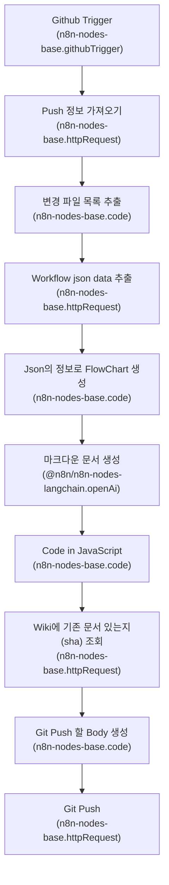

# Overview
이 문서는 제공된 워크플로우 메타데이터 및 Mermaid 다이어그램을 기반으로 작성되었습니다. 문서화는 입력으로 제공된 정보만을 근거로 하였으며, 정보가 없거나 불명확한 항목은 "확인 필요"로 표기했습니다.

# Diagram (Mermaid)

# Nodes
| name | type | disabled | role |
|---|---|---:|---|
| Github_Trigger | n8n-nodes-base.githubTrigger | 확인 필요 | 확인 필요 |
| Push_정보_가져오기 | n8n-nodes-base.httpRequest | 확인 필요 | 확인 필요 |
| 변경_파일_목록_추출 | n8n-nodes-base.code | 확인 필요 | 확인 필요 |
| Workflow_json_data_추출 | n8n-nodes-base.httpRequest | 확인 필요 | 확인 필요 |
| Json의_정보로_FlowChart_생성 | n8n-nodes-base.code | 확인 필요 | 확인 필요 |
| 마크다운_문서_생성 | @n8n/n8n-nodes-langchain.openAi | 확인 필요 | 확인 필요 |
| Code_in_JavaScript | n8n-nodes-base.code | 확인 필요 | 확인 필요 |
| Wiki에_기존_문서_있는지_sha__조회 | n8n-nodes-base.httpRequest | 확인 필요 | 확인 필요 |
| Git_Push_할_Body_생성 | n8n-nodes-base.code | 확인 필요 | 확인 필요 |
| Git_Push | n8n-nodes-base.httpRequest | 확인 필요 | 확인 필요 |

# Flow (단계별)
1. Github_Trigger  
   - 목적: GitHub 이벤트로 워크플로우를 시작하는 트리거 노드.  
   - 상세: 어떤 이벤트로 트리거되는지(예: push, pull request 등) 정보는 제공되지 않음 — 확인 필요.

2. Push_정보_가져오기 (httpRequest)  
   - 목적: 푸시 관련 정보를 가져오는 HTTP 요청 노드.  
   - 상세: 호출하는 엔드포인트 및 요청/응답 스펙은 제공되지 않음 — 확인 필요.

3. 변경_파일_목록_추출 (code)  
   - 목적: 가져온 푸시 정보에서 변경된 파일 목록을 추출하는 코드 노드.  
   - 상세: 입력/출력 데이터 구조 및 로직은 제공되지 않음 — 확인 필요.

4. Workflow_json_data_추출 (httpRequest)  
   - 목적: 워크플로우 관련 JSON 데이터를 외부에서 가져오는 HTTP 요청 노드.  
   - 상세: 대상 리소스 및 요청 세부정보는 제공되지 않음 — 확인 필요.

5. Json의_정보로_FlowChart_생성 (code)  
   - 목적: 획득한 JSON 정보로부터 FlowChart 정보를 생성하는 코드 노드.  
   - 상세: 변환 로직 및 출력 포맷은 제공되지 않음 — 확인 필요.

6. 마크다운_문서_생성 (@n8n/n8n-nodes-langchain.openAi)  
   - 목적: FlowChart 정보를 기반으로 마크다운 문서를 생성하는 OpenAI( LangChain ) 노드.  
   - 상세: 프롬프트, 모델 파라미터, 출력 형식 등은 제공되지 않음 — 확인 필요.

7. Code_in_JavaScript (code)  
   - 목적: 마크다운 문서를 후처리하거나 추가 변환을 수행하는 자바스크립트 코드 노드.  
   - 상세: 수행하는 구체적인 처리 내용은 제공되지 않음 — 확인 필요.

8. Wiki에_기존_문서_있는지_sha__조회 (httpRequest)  
   - 목적: Wiki(또는 저장소)의 기존 문서가 있는지, 있다면 sha 조회(확인)하는 HTTP 요청 노드.  
   - 상세: 조회 대상과 응답 처리 방식은 제공되지 않음 — 확인 필요.

9. Git_Push_할_Body_생성 (code)  
   - 목적: Git Push에 사용할 요청 바디(커밋/업데이트 정보 등)를 생성하는 코드 노드.  
   - 상세: 생성되는 바디의 구조 및 metadata는 제공되지 않음 — 확인 필요.

10. Git_Push (httpRequest)  
    - 목적: 실제로 Git Push(파일 생성/업데이트)를 수행하는 HTTP 요청 노드.  
    - 상세: 어떤 엔드포인트(예: GitHub API)와 인증 방식 등을 사용하는지는 제공되지 않음 — 확인 필요.

# Branching
- 제공된 Mermaid 다이어그램 및 노드 목록에는 조건분기(IF) 노드가 나타나지 않습니다.  
- 따라서 true/false 기반 분기 로직은 없음(또는 제공되지 않음). 추가 분기 정보가 필요하면 확인 필요.

# External Integrations
- GitHub  
  - 근거: Github Trigger 노드명 및 Git Push 관련 노드 명칭.  
  - 사용처(노드): Github_Trigger, Push_정보_가져오기, Wiki에_기존_문서_있는지_sha__조회, Git_Push 등.  
  - 상세한 엔드포인트/권한/토큰/스코프 정보: 확인 필요.

- OpenAI (LangChain)  
  - 근거: 마크다운_문서_생성 노드 타입(@n8n/n8n-nodes-langchain.openAi).  
  - 사용처(노드): 마크다운 문서 생성.  
  - 모델/프롬프트/요금 관련 설정: 확인 필요.

- Generic HTTP Requests  
  - 근거: 여러 노드가 n8n-nodes-base.httpRequest 타입으로 존재.  
  - 사용처: 외부 API 호출 및 데이터 조회/푸시.  
  - 호출 대상, 인증 헤더, 타임아웃, 리트라이 정책 등: 확인 필요.

# Ops Notes
- 트리거: GitHub 트리거로 시작함(정확한 이벤트 유형 및 필터는 확인 필요).  
- 워크플로우 결과: 최종적으로 Git Push를 수행하여 Wiki/저장소를 수정하는 것으로 보임 — 권한 및 검증 필요(확인 필요).  
- 인증/자격증명: 각 httpRequest 및 GitHub 트리거/Push는 인증 필요성이 예상되나 구체적 자격증명(토큰, 스코프)은 제공되지 않음 — 확인 필요.  
- 에러 처리 및 재시도: 워크플로우의 예외 처리, 재시도 로직, 실패 시 롤백에 대한 정보 없음 — 확인 필요.  
- 로깅/모니터링: 로깅 수준, 모니터링/알림 설정에 대한 정보 없음 — 확인 필요.  
- 민감정보: OpenAI 키·GitHub 토큰 등 민감정보 사용 가능성이 있으나 상세 설정 불명 — 확인 필요.  
- 변경관리: 기존 문서의 sha 조회 후 바디 생성으로 업데이트 처리하는 흐름으로 보이나, 충돌 해결 정책(예: 병합, 강제 overwrite 등)은 제공되지 않음 — 확인 필요.

