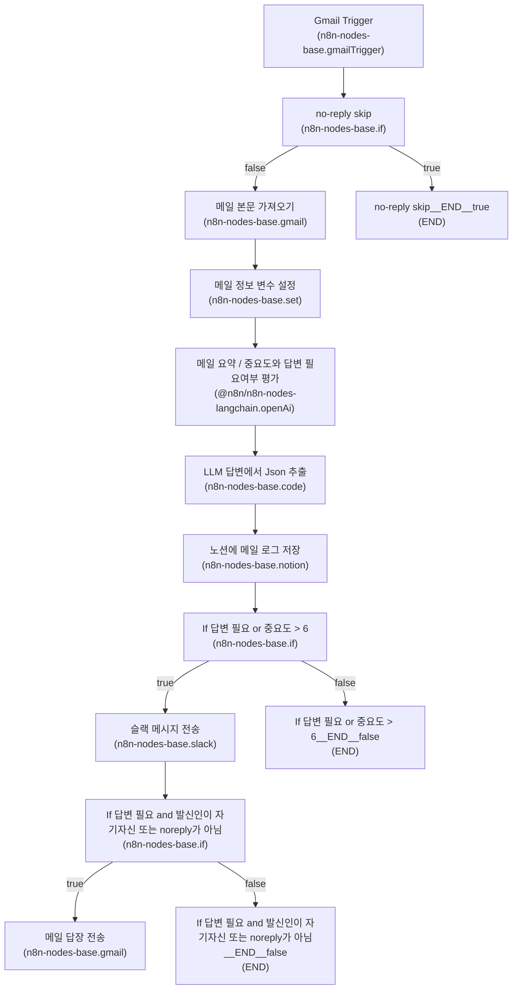

# Overview
이 문서는 제공된 워크플로우 메타정보(머메이드 다이어그램 및 노드 목록)를 기반으로 작성되었습니다. 명시되지 않은 정보는 추측하지 않고 "확인 필요"로 표기했습니다.

# Diagram (Mermaid)

# Nodes
| name | type | disabled | role |
|---|---|---:|---|
| Gmail Trigger | n8n-nodes-base.gmailTrigger | 확인 필요 | 확인 필요 |
| no-reply skip | n8n-nodes-base.if | 확인 필요 | 확인 필요 |
| 메일 본문 가져오기 | n8n-nodes-base.gmail | 확인 필요 | 확인 필요 |
| 메일 요약 / 중요도와 답변 필요여부 평가 | @n8n/n8n-nodes-langchain.openAi | 확인 필요 | 확인 필요 |
| LLM 답변에서 Json 추출 | n8n-nodes-base.code | 확인 필요 | 확인 필요 |
| 노션에 메일 로그 저장 | n8n-nodes-base.notion | 확인 필요 | 확인 필요 |
| 슬랙 메시지 전송 | n8n-nodes-base.slack | 확인 필요 | 확인 필요 |
| If 답변 필요 or 중요도 > 6 | n8n-nodes-base.if | 확인 필요 | 확인 필요 |
| 메일 답장 전송 | n8n-nodes-base.gmail | 확인 필요 | 확인 필요 |
| If 답변 필요 and 발신인이 자기자신 또는 noreply가 아님 | n8n-nodes-base.if | 확인 필요 | 확인 필요 |
| 메일 정보 변수 설정 | n8n-nodes-base.set | 확인 필요 | 확인 필요 |
| no_reply_skip__END__true | END | 확인 필요 | 확인 필요 |
| If_답변_필요_or_중요도___6__END__false | END | 확인 필요 | 확인 필요 |
| If_답변_필요_and_발신인이_자기자신_또는_noreply가_아님__END__false | END | 확인 필요 | 확인 필요 |

# Flow (단계별)
1. Gmail Trigger가 워크플로우를 시작한다.  
2. no-reply skip(IF) 노드로 흐름이 전달된다.  
   - no-reply skip의 결과가 true이면 워크플로우는 no_reply_skip__END__true(END)로 종료된다.  
   - false이면 다음 단계로 진행된다.
3. 메일 본문 가져오기(Gmail) 노드가 실행된다.  
4. 메일 정보 변수 설정(set) 노드가 실행된다.  
5. 메일 요약 / 중요도와 답변 필요여부 평가(OpenAI LangChain) 노드가 실행된다.  
6. LLM 답변에서 Json 추출(code) 노드가 실행된다.  
7. 노션에 메일 로그 저장(notion) 노드가 실행된다.  
8. If 답변 필요 or 중요도 > 6(IF) 노드로 흐름이 전달된다.  
   - true이면 슬랙 메시지 전송(slack) 노드가 실행된다.  
   - false이면 If_답변_필요_or_중요도___6__END__false(END)로 종료된다.
9. 슬랙 메시지 전송 이후, If 답변 필요 and 발신인이 자기자신 또는 noreply가 아님(IF) 노드로 흐름이 전달된다.  
   - true이면 메일 답장 전송(Gmail) 노드가 실행된다.  
   - false이면 If_답변_필요_and_발신인이_자기자신_또는_noreply가_아님__END__false(END)로 종료된다.

# Branching
- no-reply skip (n8n-nodes-base.if)
  - true -> no_reply_skip__END__true (END)
  - false -> 메일 본문 가져오기

- If 답변 필요 or 중요도 > 6 (n8n-nodes-base.if)
  - true -> 슬랙 메시지 전송
  - false -> If_답변_필요_or_중요도___6__END__false (END)

- If 답변 필요 and 발신인이 자기자신 또는 noreply가 아님 (n8n-nodes-base.if)
  - true -> 메일 답장 전송
  - false -> If_답변_필요_and_발신인이_자기자신_또는_noreply가_아님__END__false (END)

# External Integrations
다음 외부 통합 노드가 워크플로우에 사용됩니다(머메이드 다이어그램 기반):
- Gmail (n8n-nodes-base.gmail, n8n-nodes-base.gmailTrigger)  
- OpenAI via LangChain 노드 (@n8n/n8n-nodes-langchain.openAi)  
- Notion (n8n-nodes-base.notion)  
- Slack (n8n-nodes-base.slack)

구체적 설정(예: 인증 방식, API 키, OAuth 범위, 연결 이름 등)은 제공되지 않았습니다. 따라서 각 통합의 상세 구성 정보는 "확인 필요"입니다.

# Ops Notes
- 워크플로우에 여러 END 노드가 존재함: no_reply_skip__END__true, If_답변_필요_or_중요도___6__END__false, If_답변_필요_and_발신인이_자기자신_또는_noreply가_아님__END__false. 종료 포인트를 통해 특정 분기에서 처리가 중단됨을 확인할 것.  
- LLM 답변에서 Json 추출(code) 노드가 있으며, 이후 노션 저장 및 분기 판정에 사용되는 것으로 보임. 해당 코드의 입력/출력 포맷과 에러 처리 로직은 문서에 없음 — 확인 필요.  
- 인증·자격증명: Gmail, OpenAI, Notion, Slack 등 통합별로 인증 정보가 필요함. 상세한 인증 방식 및 연결 설정은 제공되지 않음 — 확인 필요.  
- 에러 핸들링 및 재시도 정책: 정의된 정보 없음 — 확인 필요.  
- 스로틀링/쿼터: OpenAI 및 외부 API 사용시 쿼터/비용 고려 필요. 구체 정책은 제공되지 않음 — 확인 필요.  
- 테스트 케이스: no-reply 필터(true 경로), 중요도/답변 필요 여부로 인한 메시지 전송 및 회신(true/false) 등 주요 분기를 각각 검증할 것. 구체한 테스트 데이터와 기대 출력은 제공되지 않음 — 확인 필요.  
- 모니터링/로그: 노션에 메일 로그 저장 노드가 있으나, 전체 워크플로우 실패/성공 로그 집계 방법은 제공되지 않음 — 확인 필요.

(참고: 위 문서는 제공된 머메이드 다이어그램 및 노드 메타 정보만을 근거로 작성되었습니다. 누락된 상세 설정 정보는 "확인 필요"로 표기했습니다.)