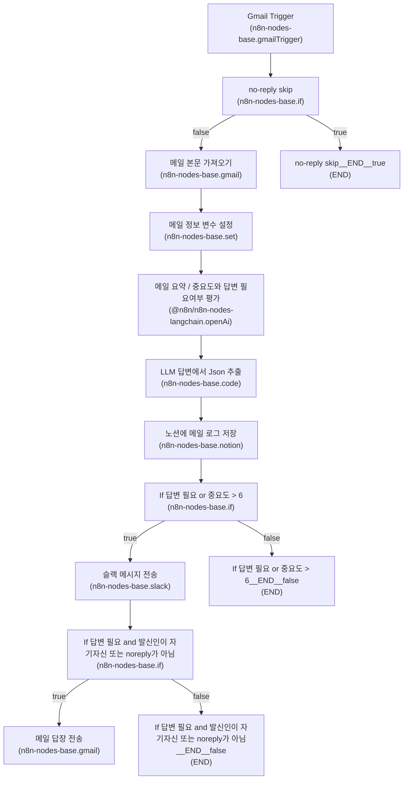

# Overview

이 워크플로우는 Gmail 수신을 트리거로 하여 메일을 분류하고(예: no-reply 스킵), 메일 본문을 가져와 요약 및 중요도/답변 필요 여부를 평가한 뒤(LLM 사용), 결과를 Notion에 기록하고 조건에 따라 Slack 알림 전송 및 메일 답장을 자동으로 보내는 흐름을 가집니다.

구체적 구성(노드/엣지/머메이드)은 제공된 입력을 기준으로 문서화했습니다. 세부 설정(예: 각 노드의 파라미터, 인증 정보 등)은 문서에 포함되어 있지 않아 해당 항목들은 "확인 필요"로 표기했습니다.

---

## Diagram (Mermaid)

---

## Nodes

| name | type | disabled | role |
|---|---:|---:|---|
| Gmail_Trigger | n8n-nodes-base.gmailTrigger | 확인 필요 | 확인 필요 |
| no_reply_skip | n8n-nodes-base.if | 확인 필요 | 확인 필요 |
| 메일_본문_가져오기 | n8n-nodes-base.gmail | 확인 필요 | 확인 필요 |
| 메일_요약___중요도와_답변_필요여부_평가 | @n8n/n8n-nodes-langchain.openAi | 확인 필요 | 확인 필요 |
| LLM_답변에서_Json_추출 | n8n-nodes-base.code | 확인 필요 | 확인 필요 |
| 노션에_메일_로그_저장 | n8n-nodes-base.notion | 확인 필요 | 확인 필요 |
| 슬랙_메시지_전송 | n8n-nodes-base.slack | 확인 필요 | 확인 필요 |
| If_답변_필요_or_중요도___6 | n8n-nodes-base.if | 확인 필요 | 확인 필요 |
| 메일_답장_전송 | n8n-nodes-base.gmail | 확인 필요 | 확인 필요 |
| If_답변_필요_and_발신인이_자기자신_또는_noreply가_아님 | n8n-nodes-base.if | 확인 필요 | 확인 필요 |
| 메일_정보_변수_설정 | n8n-nodes-base.set | 확인 필요 | 확인 필요 |
| no_reply_skip__END__true | END | 확인 필요 | 확인 필요 |
| If_답변_필요_or_중요도___6__END__false | END | 확인 필요 | 확인 필요 |
| If_답변_필요_and_발신인이_자기자신_또는_noreply가_아님__END__false | END | 확인 필요 | 확인 필요 |

(각 노드의 상세 설정/파라미터/비활성화 여부/역할 정보는 제공되지 않았습니다 — 확인 필요)

---

## Flow (단계별)

1. Gmail_Trigger가 트리거됨.
2. no_reply_skip (if) 노드에서 조건 평가:
   - true: 워크플로우 종료(no_reply_skip__END__true).
   - false: 다음 단계로 진행.
3. 메일_본문_가져오기 (Gmail) — 메일 본문을 가져옴.
4. 메일_정보_변수_설정 (Set) — 메일 관련 변수를 설정함.
5. 메일_요약 / 중요도와 답변 필요여부 평가 (LangChain OpenAI) — LLM에 의한 평가/요약 수행.
6. LLM 답변에서 Json 추출 (Code) — LLM 응답에서 JSON 추출(또는 변환).
7. 노션에 메일 로그 저장 (Notion) — 추출된 정보/로그를 Notion에 저장.
8. If_답변_필요_or_중요도___6 (if) 에서 조건 평가:
   - true: 슬랙_메시지_전송으로 이동.
   - false: 워크플로우 종료(If_답변_필요_or_중요도___6__END__false).
9. 슬랙_메시지_전송 (Slack) — 알림 전송 후 다음 분기 노드로 이동.
10. If_답변_필요_and_발신인이_자기자신_또는_noreply가_아님 (if) 에서 조건 평가:
    - true: 메일_답장_전송 (Gmail) 실행.
    - false: 워크플로우 종료(If_답변_필요_and_발신인이_자기자신_또는_noreply가_아님__END__false).
11. (메일_답장_전송 실행 시) 워크플로우 종료(후속 흐름은 제공된 입력엔 없음).

(노드 간 연결/순서는 Mermaid 다이어그램을 기준으로 기술했습니다. 각 노드의 내부 파라미터/필터 조건/메시지 템플릿 등은 제공되지 않았습니다 — 확인 필요)

---

## Branching

- no_reply_skip (n8n-nodes-base.if)
  - true -> no_reply_skip__END__true (END)
  - false -> 메일_본문_가져오기

- If_답변_필요_or_중요도___6 (n8n-nodes-base.if)
  - true -> 슬랙_메시지_전송
  - false -> If_답변_필요_or_중요도___6__END__false (END)

- If_답변_필요_and_발신인이_자기자신_또는_noreply가_아님 (n8n-nodes-base.if)
  - true -> 메일_답장_전송
  - false -> If_답변_필요_and_발신인이_자기자신_또는_noreply가_아님__END__false (END)

(각 if 조건에 사용된 구체적 표현식/조건문 내용은 제공되지 않았습니다 — 확인 필요)

---

## External Integrations

다음 외부 연동 노드들이 사용됩니다(노드 타입 기준):

- Gmail
  - 노드: Gmail Trigger (n8n-nodes-base.gmailTrigger), 메일_본문_가져오기 (n8n-nodes-base.gmail), 메일_답장_전송 (n8n-nodes-base.gmail)
  - 설정/인증 정보: 확인 필요

- OpenAI (via LangChain node)
  - 노드: 메일_요약 / 중요도와 답변 필요여부 평가 (@n8n/n8n-nodes-langchain.openAi)
  - 모델/키/프롬프트 등 설정: 확인 필요

- Notion
  - 노드: 노션에 메일 로그 저장 (n8n-nodes-base.notion)
  - 데이터베이스/페이지 ID, 통합 토큰: 확인 필요

- Slack
  - 노드: 슬랙 메시지 전송 (n8n-nodes-base.slack)
  - 채널/토큰/메시지 포맷: 확인 필요

(각 외부 서비스의 세부 인증/권한/설정 값은 제공되지 않았습니다 — 확인 필요)

---

## Ops Notes

- 트리거/운영
  - 트리거 주기/실시간 설정: 확인 필요
  - 워크플로우 활성화 여부: 확인 필요

- 인증 및 권한
  - Gmail, Notion, Slack, OpenAI 각각의 인증(서비스 계정/API 키 등): 확인 필요
  - Gmail 권한(읽기/쓰기/보내기 스코프 등): 확인 필요

- 오류 처리 및 재시도
  - 개별 노드 실패 시 재시도 정책 및 알림 설정: 확인 필요
  - LLM 응답 실패/타임아웃 처리: 확인 필요

- 로깅 및 모니터링
  - 실행 로그 저장 위치/레벨: 확인 필요
  - 실패 시 알림(예: Slack/이메일): 확인 필요

- 안전 및 제한
  - OpenAI/LLM 사용량 및 비용 관리(요청률 제한 등): 확인 필요
  - 개인정보/민감데이터 처리 정책: 확인 필요

- 기타
  - Notion DB 스키마(저장 필드) 및 Slack 메시지 템플릿: 확인 필요
  - 메일 답장 템플릿/언어 및 서명 규칙: 확인 필요

(위 항목들에 대한 구체적 설정/값은 제공된 입력에 포함되어 있지 않습니다 — 확인 필요)